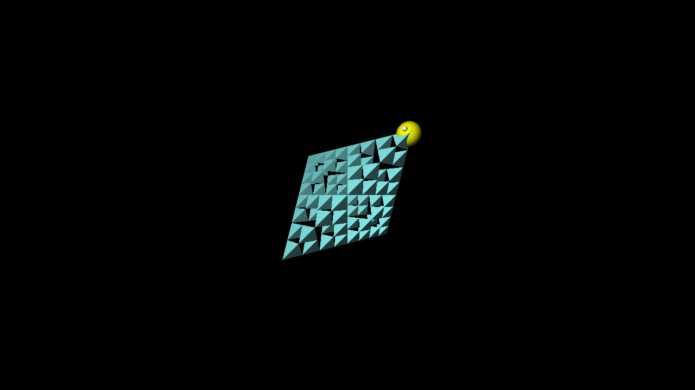

### Build
```console
mkdir build
cd build
cmake -DCMAKE_BUILD_TYPE=Release ..
make test_ray_matching
make test_ray_matching_gpu
```


### Run RayMatching on CPU 
```console
./test_ray_matching
```

Results you can find in ray_matching/results

### Run RayMatching on CPU 
```console
./test_ray_matching_gpu
```

Results you can find in ray_matching_gpu/results

### Perfomance estimation

#### CPU
| OMP_NUM_THREADS | time, s  |
|-----------------|----------|
| 1               | 0.550028 |
| 4               | 0.16358  |
| 8               | 0.107724 |

#### CUDA
| CUDA            | time, s   |
|-----------------|-----------|
| Full            | 0.0144295 |
| Kernel          | 0.0107233 |
| Memory transfer | 0.0037062 |


### Score
1. Base part - 10 
2. Camera params (look_from, look_to, fov) - 1
3. Unuque color for each object - 1
4. Cool scene with packman eating sierpinski tetrahedron  - 1

Total: 13

### Example 
